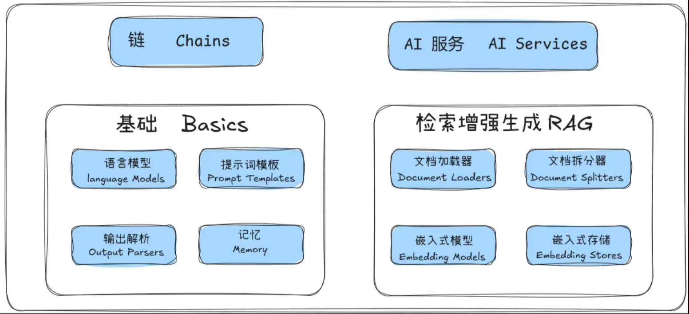

# 智能体-小黑聊股票

## 项目概述

### 目的

​		学习大语言模型和智能体基础知识，包括LangChain4j,  LLM, MCP, Embedding Model, Embedding Storage, MCP, Tools等。

**LangChain4j功能**

### 部署架构

**部署架构**

## 外部工具
### AkTools
- 构建参考：项目KnowledgeBase/Common/stock/aktools
- 启动参考：startup-backend.sh
- 接口列表参考：stock_processed.md

服务示例：
~~~
利润表-按单季度 http://127.0.0.1:8080/api/public/stock_profit_sheet_by_quarterly_em?symbol=SH600000

http://localhost:8080/api/public/stock_individual_info_em?symbol=603676
http://localhost:8080/api/public/stock_financial_abstract?symbol=603676
http://127.0.0.1:8080/api/public/stock_szse_sector_summary?symbol=当月
~~~

## Prompt
提示模板（Prompt Templates）是用于生成语言模型提示的预定义配方，可以包括指令、少样本示例和特定上下文。

## Chains and Agents
### 链（Chains）
通常，一个应用程序需要按特定顺序调用多个组件。在 LangChain 中，被称为链（Chain）。链简化了开发更复杂应用程序的过程，并使调试、维护和改进更加容易。
链还可以组合多个链来构建更复杂的应用程序，这些应用程序可能需要与多个语言模型交互。

### 代理（Agents）
LangChain 还提供了更强大的结构，例如代理（Agent）。与链不同，代理将语言模型用作推理引擎，以确定应该采取哪些操作以及操作的顺序。我们还可以为代理提供访问合适工具的权限，以执行必要的操作。
在 LangChain4j 中，代理作为 AI 服务（AI Services）提供，用于声明性地定义复杂的 AI 行为。让我们看看如何通过提供一个计算器工具，为 AI 服务赋能，从而使语言模型能够执行计算。

## 知识库与RAG
### RAG基本逻辑
创建AI服务时，可指定一个 RetrievalAugmentor 实例。
**重点：**每次调用AI服务时，指定的 RetrievalAugmentor 将被调用来增强当前的 UserMessage（用户消息）。
注：目前没有显示指定RetrievalAugmentor。

StockAgent.java
~~~java
@AiService(
        wiringMode = EXPLICIT
        , chatModel = "openAiChatModel"
        , chatMemoryProvider = "chatMemoryProviderStock"
        , tools = "akhareTools"
        , contentRetriever = "contentRetrieverStockPincone" //配置向量存储
)
public interface StockAgent {
    @SystemMessage(fromResource = "system-prompt-template.txt")
    String chat(@MemoryId Long memoryId, @UserMessage String userMessage);
}
~~~
StockAgentConfig.java
~~~java
@Bean
    ContentRetriever contentRetrieverStockPincone() {
        // 创建一个 EmbeddingStoreContentRetriever 对象，用于从嵌入存储中索引内容
        return EmbeddingStoreContentRetriever
                .builder()
                // 设置用于生成嵌入向量的嵌入模型
                .embeddingModel(qwen3EmbeddingModel)
                // 指定要使用的嵌入存储
                .embeddingStore(embeddingStore)
                // 设置最大的索引结果数量，这里表示最多返回 1 条匹配结果
                .maxResults(1)
                // 设置最小得分阈（yu）值。只有得分大于等于 0.8 的结果才能被返回
                .minScore(0.8)
                // 构建最终的 EmbeddingStoreContentRetriever 实例
                .build();
    }
~~~

### 数据向量化
1. 数据清洗：将akshare中的stock.md内容进行清洗，只保留文档结构、接口名、描述、输入参数和输出参数，并保存为stock_processed.md
2. 数据标注：将stock_processed.md按照接口进行分片（即一个方法一个分片），在stock_fragement目录中生成分片文件和原数据；
3. 数据向量化存储：遍历所有分片，将每个分片进行向量化，并保存到向量数据库中。参考FragmentEmbeddingTest.testUploadFragementKnowledge3()；

### Embedding模型和存储
向量模型用的是qwen3-embedding-0.6b，向量存储用的是Pinecone。
~~~shell
# 确保 Ollama 服务已启动（默认监听http://localhost:11434）
ollama pull dengcao/Qwen3-Embedding-0.6B:Q8_0
ollama run dengcao/Qwen3-Embedding-0.6B:Q8_0
~~~

## 其他基础知识

### 前端接口测试
https://mvnrepository.com/
~~~xml
<!-- 前后端分离中的后端接口测试工具 -->
<dependency>
      <groupId>com.github.xiaoymin</groupId>
      <artifactId>knife4j-openapi3-jakarta-spring-boot-starter</artifactId>
      <version>${knife4j.version}</version>
</dependency>
~~~
http://localhost/doc.html

### 常用Maven命令
~~~shell
cd stock-agent
lsof -i :80
# 查看项目依赖
mvn dependency:list
# 使用 Maven 的 spring-boot:run 命令运行应用程序
mvn spring-boot:run
mvn spring-boot:run -e
# 使用 Maven 编译项目
mvn compile -X
mvn package -X
~~~

## 参考资料
- [Atlas Vector Search与 LangChain4j 集成](https://www.mongodb.com/zh-cn/docs/atlas/ai-integrations/langchain4j/)
- https://docs.langchain4j.dev/category/tutorials
- [**RAG技术全面解析：Langchain4j...**](https://cloud.tencent.com/developer/article/2453301)
- 